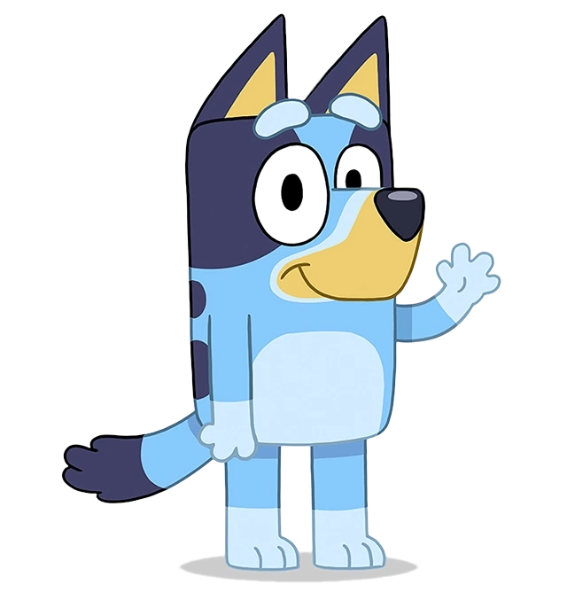

  <!-- Add badges using the following format: -->
  <!-- (urlToGithubHere) -->

<!-- PROJECT LOGO -->

  

<h3 align="center">Blue Dog API</h3>

  

Bluey API with a styled front end and games     
    <a href="https://github.com/404pandas/blue-dog-api"><strong>Explore the docs »</strong></a>
     
     
    <a href="https://github.com/404pandas/blue-dog-api">View Demo(Under development)</a>
    ·
    <a href="https://github.com/404pandas/blue-dog-api/issues">Report Bug</a>
    ·
    <a href="https://github.com/404pandas/blue-dog-api/issues">Request Feature</a>
  

<!-- TABLE OF CONTENTS -->

  
Table of Contents

  <ol>
    <li>
      <a href="#about-the-project">About The Project</a>
      <ul>
        <li><a href="#built-with">Built With</a></li>
      </ul>
    </li>
    <li>
      <a href="#getting-started">Getting Started</a>
      <ul>
        <li><a href="#installation">Installation</a></li>
      </ul>
    </li>
    <li><a href="#usage">Usage</a></li>
    <li><a href="#roadmap">Roadmap</a></li>
    <li><a href="#contributing">Contributing</a></li>
    <li><a href="#license">License</a></li>
    <li><a href="#contact">Contact</a></li>
    <li><a href="#acknowledgments">Acknowledgments</a></li>
  </ol>

<!-- ABOUT THE PROJECT -->

## About The Project

<!-- Add screenshots using the following format: -->
<!--  -->

This project was built using the MERN stack and Apollo/GraphQL. It contains mutable data for a user integration, styled front end, and games.
It uses Materialize for a CSS framework.
It uses Mongoose as an ORM.
It will use Netlify for deployment.
It also makes use of packages JWT and Bcrypt

### Built With

Once completely built, this application will function as a deployed app on Netlify and a free API on RapidAPI.

## Roadmap

- [x] Episode Names
- [x] Episode Descriptions
- [ ] Episode Lengths
- [x] Episode Characters
- [ ] Quotes
- [x] Character Names
- [x] Character Descriptions
- [ ] Character Images
- [x] Locations
- [ ] Location Images
- [ ] Episode Images
- [ ] Filter by Australian Content
- [x] Books
- [ ] Toys
- [ ] Garden gnomes
- [ ] Long Dog
- [ ] Songs
- [ ] Trivia- ask Trivia Bros for collab

See the [open issues](https://github.com/404pandas/blue-dog-api/issues) for a full list of proposed features (and known issues).

<!-- CONTRIBUTING -->

## Contributing

Contributions are what make the open source community such an amazing place to learn, inspire, and create. Any contributions you make are **greatly appreciated**.
 
If you have a suggestion that would make this better, please fork the repo and create a pull request. You can also simply open an issue with the tag "enhancement".
  
Don't forget to give the project a star! Thanks again!

1. Fork the Project
2. Create your Feature Branch (git checkout -b feature/AmazingFeature)
3. Commit your Changes (git commit -m 'Add some AmazingFeature')
4. Push to the Branch (git push origin feature/AmazingFeature)
5. Open a Pull Request

<!-- LICENSE -->

## License

This project is licensed under the MIT license.

See LICENSE.txt for more information.

<!-- CONTACT -->

## Contact

Mary Elenius - mary.panda.jackson@gmail.com

Project Link: [https://github.com/404pandas/blue-dog-api](https://github.com/404pandas/blue-dog-api)

Portfolios: [Javascript]([https://404pandas.github.io]) || [React]([https://404pandas.github.io])

<!-- ACKNOWLEDGMENTS -->

## Acknowledgments

I would like to give a big shoutout to my partner in crime and daughter, Yennefer! Every day she proves she is small yet mighty!
 
I would also like to acknowledge my friends and family for supporting me through this journey.
 
This API was created using the guide at [this](https://rapidapi.com/guides/build-api-publish-on-rapidapi) page on RapidAPI.
 
This API is listed on [RapidAPI](https://rapidapi.com/).
 
This API is stored on [Github](https://github.com/).
 
This API is hosted on [Netlify](https://www.netlify.com/).

<!-- Resources -->

## Resources Used

The following is a list of resources used in the making of this API
 
https://www.bluey.tv/watch/
 
https://blueypedia.fandom.com/wiki/Bluey_(TV_series)

<!-- Counter -->

## Time Bluey Watched

This portion of the Readme is devoted to keeping track how many times I've rewatched Bluey in its entirety while developing this app.
 
Current count: 14
