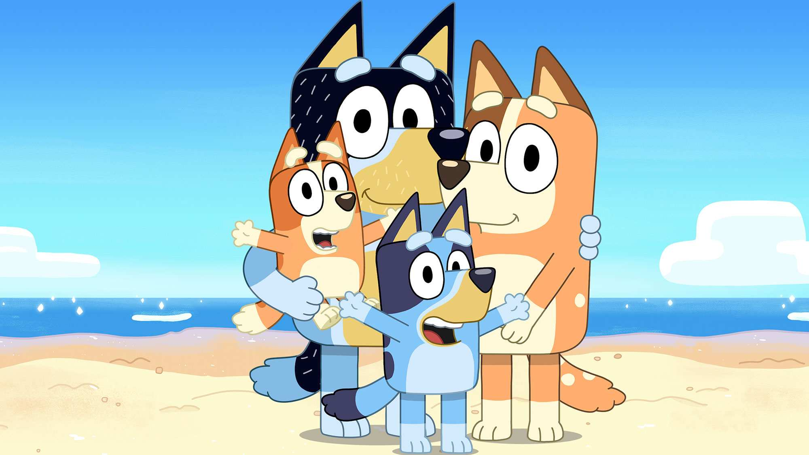

  <!-- Add badges using the following format: -->
  <!-- (urlToGithubHere) -->

<!-- PROJECT LOGO -->

  

<h3 align="center">Blue Dog API</h3>

  

Weather Dashboard using newly open source Pooh drawings     
    <a href="https://github.com/404pandas/blue-dog-api"><strong>Explore the docs »</strong></a>
     
     
    <a href="https://github.com/404pandas/blue-dog-api">View Demo(Broken)</a>
    ·
    <a href="https://github.com/404pandas/blue-dog-api/issues">Report Bug</a>
    ·
    <a href="https://github.com/404pandas/blue-dog-api/issues">Request Feature</a>
  

<!-- TABLE OF CONTENTS -->

  
Table of Contents

  <ol>
    <li>
      <a href="#about-the-project">About The Project</a>
      <ul>
        <li><a href="#built-with">Built With</a></li>
      </ul>
    </li>
    <li>
      <a href="#getting-started">Getting Started</a>
      <ul>
        <li><a href="#installation">Installation</a></li>
      </ul>
    </li>
    <li><a href="#usage">Usage</a></li>
    <li><a href="#roadmap">Roadmap</a></li>
    <li><a href="#contributing">Contributing</a></li>
    <li><a href="#license">License</a></li>
    <li><a href="#contact">Contact</a></li>
    <li><a href="#acknowledgments">Acknowledgments</a></li>
  </ol>

<!-- ABOUT THE PROJECT -->

## About The Project

<!-- Add screenshots using the following format: -->
<!--  -->

This project was built with basic Javascript, Html, and CSS.
It uses Materialize for a CSS framework.
It also makes use of packages dayjs and jquery and gsap

### Built With

<!--  Dayjs, gsap, jquery, materialize, javascript, css, html, node.js npm vs code -->

<!-- GETTING STARTED -->

## Getting Started

Once completely built, this application will function as a deployed app on Netlify

### Installation

1. Clone the repo
   git clone https://github.com/404pandas/blue-dog-api.git

<!-- USAGE EXAMPLES -->

## Usage

Once the app is functional, screenshots will be added in this section.

<!-- ROADMAP -->

## Roadmap

- [ ] Episode Names
- [ ] Episode Descriptions
- [ ] Episode Lengths
- [ ] Episode Characters
- [ ] Quotes
- [ ] Character Names
- [ ] Character Descriptions
- [ ] Character Images
- [ ] Locations
- [ ] Location Images
- [ ] Episode Images
- [ ] Quotes - done through scripts, do last because ugh
- [ ] Filter by Australian Content
- [ ] Books
- [ ] Toys
- [ ] Garden gnomes
- [ ] Long Dog
- [ ] Songs
- [ ] Trivia- asking Trivia Bros for collab

See the [open issues](https://github.com/404pandas/blue-dog-api/issues) for a full list of proposed features (and known issues).

<!-- CONTRIBUTING -->

## Contributing

Contributions are what make the open source community such an amazing place to learn, inspire, and create. Any contributions you make are **greatly appreciated**.

If you have a suggestion that would make this better, please fork the repo and create a pull request. You can also simply open an issue with the tag "enhancement".
Don't forget to give the project a star! Thanks again!

1. Fork the Project
2. Create your Feature Branch (git checkout -b feature/AmazingFeature)
3. Commit your Changes (git commit -m 'Add some AmazingFeature')
4. Push to the Branch (git push origin feature/AmazingFeature)
5. Open a Pull Request

<!-- LICENSE -->

## License

This project is licensed under the MIT license.

See LICENSE.txt for more information.

<!-- CONTACT -->

## Contact

Mary Elenius - mary.panda.jackson@gmail.com

Project Link: [https://github.com/404pandas/blue-dog-api](https://github.com/404pandas/blue-dog-api)

<!-- ACKNOWLEDGMENTS -->

## Acknowledgments

I would like to give a big shoutout to my partner in crime and daughter, Yennefer! Every day she proves she is small yet mighty!
This API was created using the guide at [this](https://rapidapi.com/guides/build-api-publish-on-rapidapi) page on RapidAPI.
This API is listed on [RapidAPI](https://rapidapi.com/).
This API is stored on [Github](https://github.com/).
This API is hosted on [Netlify](https://www.netlify.com/).

<!-- Resources -->

## Resources Used

The following is a list of resources used in the making of this API
https://www.bluey.tv/watch/
https://blueypedia.fandom.com/wiki/Bluey_(TV_series)

<!-- Counter -->

## Time Bluey Watched

This portion of the Readme is devoted to keeping track how many times I've rewatched Bluey in its entirety while developing this app.
Current count: 9
